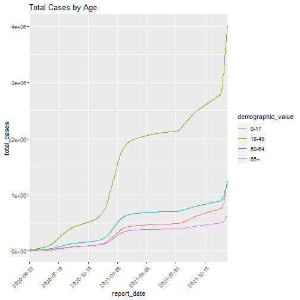
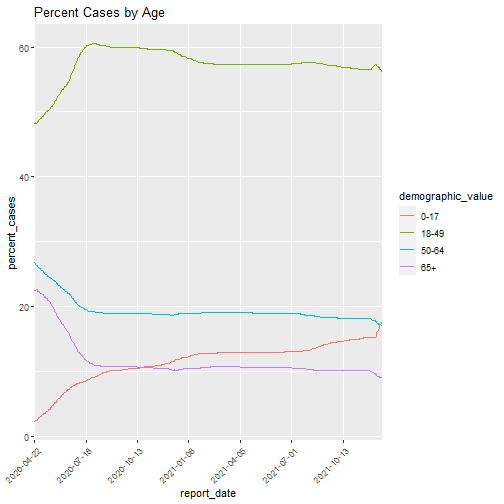
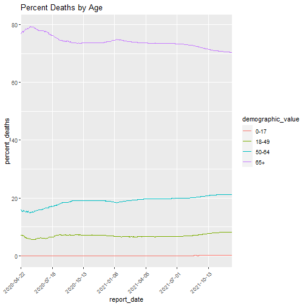
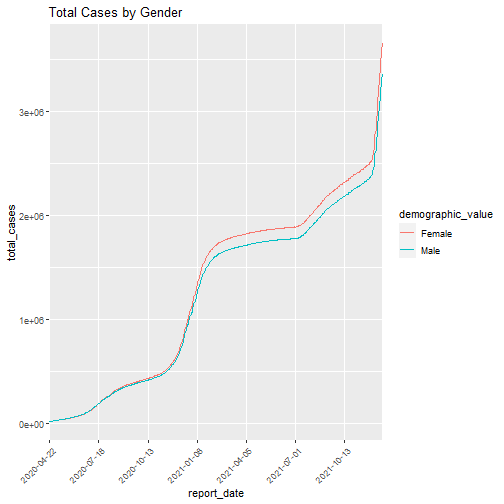
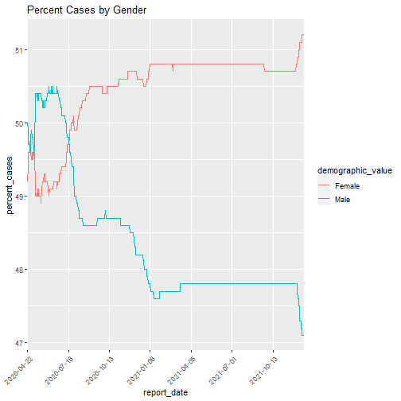
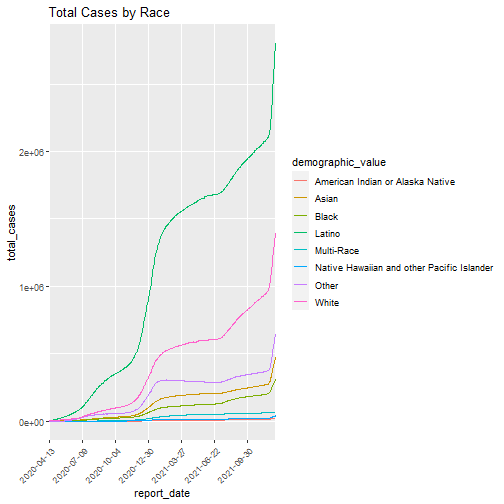
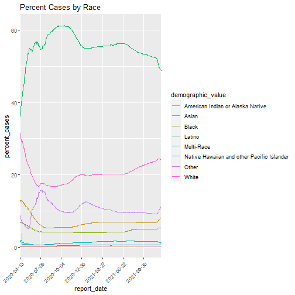
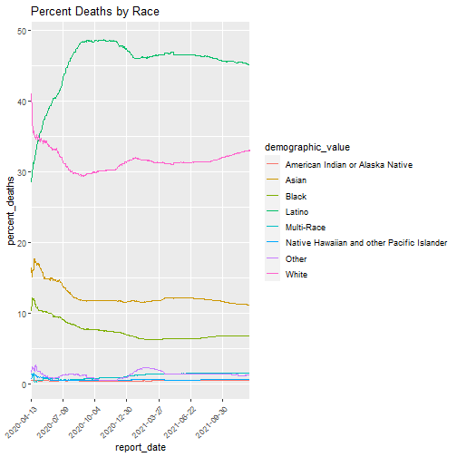

```r
library(dplyr)
library(ggplot2)
library(scales)

setwd("C:/Users/dongj/Desktop/Covid_Cal/Statewide_case_statistics_and_demographics")

data <- read.csv("./dataset/covid19casesdemographics_012122.csv")
data_v1 <- read.csv("./dataset/covid19casesdemographics_012122.csv")


unique(data_v1$demographic_category)
```

```
## [1] "Age Group"      "Gender"         "Race Ethnicity"
```

```r
age_group_data <- data_v1[data_v1$demographic_category =='Age Group',]
head(age_group_data,3)
```

```
##   demographic_category demographic_value total_cases percent_cases deaths percent_deaths
## 1            Age Group              0-17         855           2.3      0              0
## 2            Age Group              0-17         936           2.4      0              0
## 3            Age Group              0-17        1011           2.5      0              0
##   percent_of_ca_population report_date
## 1                     22.5  2020-04-22
## 2                     22.5  2020-04-23
## 3                     22.5  2020-04-24
```


```r
age_group_data <- filter(age_group_data,
                        !demographic_value %in% c('Missing','missing','Total'))

age_filter<- age_group_data %>% 
            filter(demographic_value %in% c("0-17", "18-49", "50-64", "65+"))

age_filter %>%
  ggplot( aes(x=report_date, y=total_cases, group=demographic_value, color=demographic_value)) +
  geom_line()+
  scale_x_discrete(breaks = function(x) x[seq(1, length(x), by = 3*29)])+
  labs(
    title="Total Cases by Age"
  )+
  theme(axis.text.x = element_text(angle = 45, vjust = 1, hjust = 1))
```




```r
age_filter %>%
  ggplot( aes(x=report_date, y=percent_cases, group=demographic_value, color=demographic_value)) +
  geom_line()+
  scale_x_discrete(breaks = function(x) x[seq(1, length(x), by = 3*29)])+
  labs(
    title="Percent Cases by Age"
  )+
  theme(axis.text.x = element_text(angle = 45, vjust = 1, hjust = 1))
```




```r
age_filter %>%
  ggplot( aes(x=report_date, y=percent_deaths, group=demographic_value, color=demographic_value)) +
  geom_line()+
  scale_x_discrete(breaks = function(x) x[seq(1, length(x), by = 3*29)])+
  labs(
    title="Percent Deaths by Age"
  )+
  theme(axis.text.x = element_text(angle = 45, vjust = 1, hjust = 1))
```




```r
gender_group_data <- data_v1[data_v1$demographic_category =='Gender',]
unique(gender_group_data$demographic_value )
```

```
## [1] "Female"  "Male"    "Total"   "Unknown"
```

```r
gender_group_data <- filter(gender_group_data,
                         !demographic_value %in% c("Unknown",'Total'))

gender_filter<- gender_group_data %>% 
  filter(demographic_value %in% c("Female", "Male"))
```


```r
gender_filter %>%
  ggplot( aes(x=report_date, y=total_cases, group=demographic_value, color=demographic_value)) +
  geom_line()+
  scale_x_discrete(breaks = function(x) x[seq(1, length(x), by = 3*29)])+
  labs(
    title="Total Cases by Gender"
  )+
  theme(axis.text.x = element_text(angle = 45, vjust = 1, hjust = 1))
```




```r
gender_filter %>%
  ggplot( aes(x=report_date, y=percent_cases, group=demographic_value, color=demographic_value)) +
  geom_line()+
  scale_x_discrete(breaks = function(x) x[seq(1, length(x), by = 3*29)])+
  labs(
    title="Percent Cases by Gender"
  )+
  theme(axis.text.x = element_text(angle = 45, vjust = 1, hjust = 1))
```




```r
gender_filter %>%
  ggplot( aes(x=report_date, y=percent_deaths, group=demographic_value, color=demographic_value)) +
  geom_line()+
  scale_x_discrete(breaks = function(x) x[seq(1, length(x), by = 3*29)])+
  labs(
    title="Percent Deaths by Gender"
  )+
  theme(axis.text.x = element_text(angle = 45, vjust = 1, hjust = 1))
```


```r
race_group_data <- data_v1[data_v1$demographic_category =='Race Ethnicity',]
unique(race_group_data$demographic_value )
```

```
## [1] "American Indian or Alaska Native"          
## [2] "Asian"                                     
## [3] "Black"                                     
## [4] "Latino"                                    
## [5] "Multi-Race"                                
## [6] "Native Hawaiian and other Pacific Islander"
## [7] "Other"                                     
## [8] "Total"                                     
## [9] "White"
```

```r
race_group_data <- filter(race_group_data,
                            !demographic_value %in% c('Total'))

race_filter<- race_group_data %>% 
  filter(demographic_value %in% c("American Indian or Alaska Native", "Asian","Black",
                                  "Latino", "Multi-Race", 
                                  "Native Hawaiian and other Pacific Islander",
                                  "Other","White"))
```


```r
race_filter %>%
  ggplot( aes(x=report_date, y=total_cases, group=demographic_value, color=demographic_value)) +
  geom_line()+
  scale_x_discrete(breaks = function(x) x[seq(1, length(x), by = 3*29)])+
  labs(
    title="Total Cases by Race"
  )+
  theme(axis.text.x = element_text(angle = 45, vjust = 1, hjust = 1))
```




```r
race_filter %>%
  ggplot( aes(x=report_date, y=percent_cases, group=demographic_value, color=demographic_value)) +
  geom_line()+
  scale_x_discrete(breaks = function(x) x[seq(1, length(x), by = 3*29)])+
  labs(
    title="Percent Cases by Race"
  )+
  theme(axis.text.x = element_text(angle = 45, vjust = 1, hjust = 1))
```




```r
race_filter %>%
  ggplot( aes(x=report_date, y=percent_deaths, group=demographic_value, color=demographic_value)) +
  geom_line()+
  scale_x_discrete(breaks = function(x) x[seq(1, length(x), by = 3*29)])+
  labs(
    title="Percent Deaths by Race"
  )+
  theme(axis.text.x = element_text(angle = 45, vjust = 1, hjust = 1))
```


